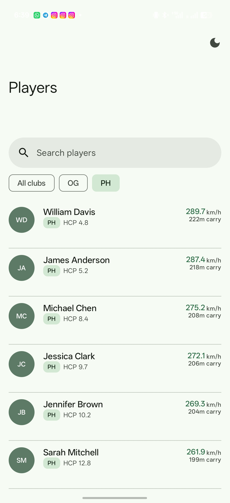
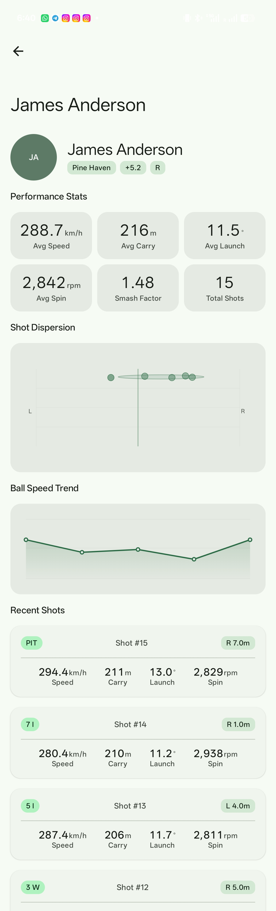
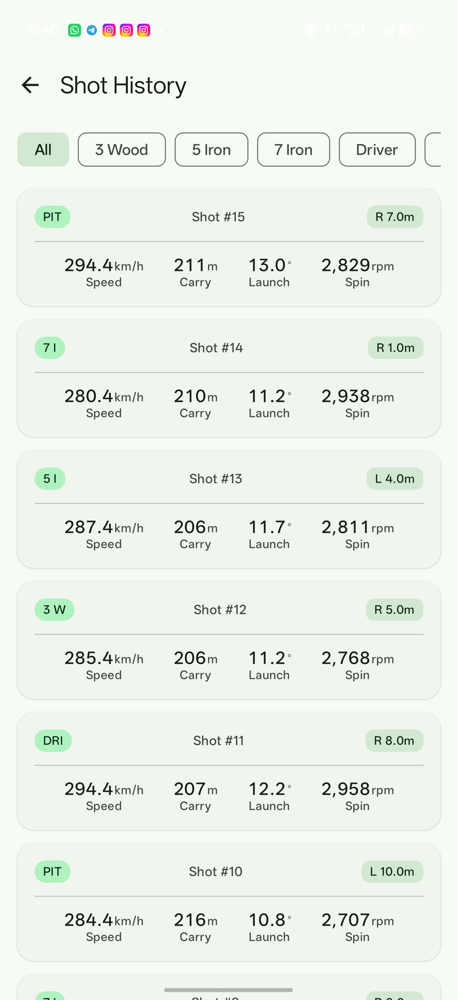
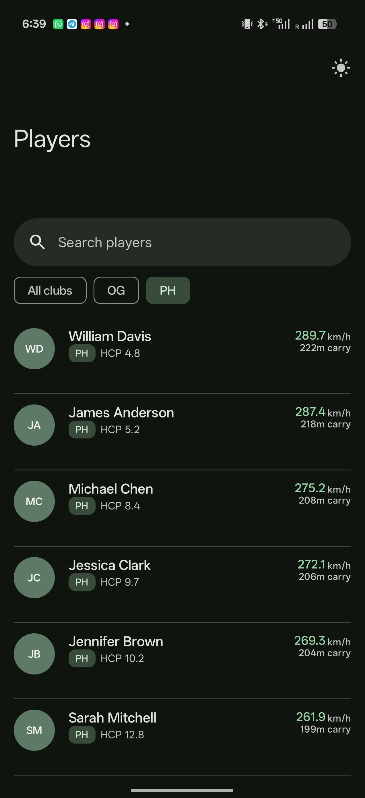
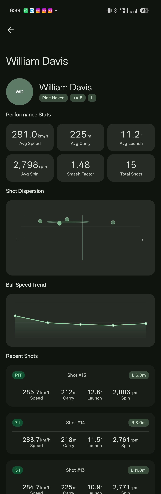
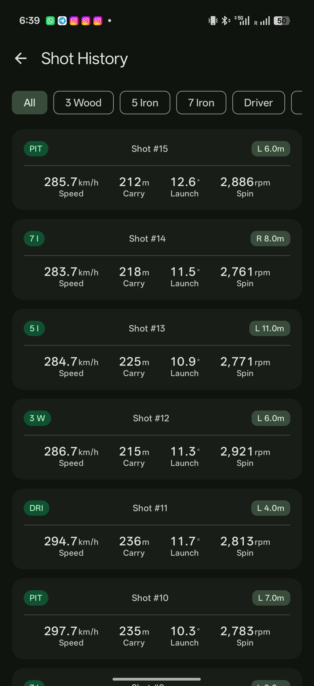

# Golf Performance Tracker

A native Android app for tracking golf shot data, inspired by Rapsodo. Built with modern Android architecture: Jetpack Compose, Paging 3 offline-first, MVVM + Clean Architecture, Hilt DI, Room, and Material Design 3.

---

## Screenshots

<table>
  <tr>
    <th align="center">Players List</th>
    <th align="center">Player Detail</th>
    <th align="center">Shot History</th>
  </tr>
  <tr>
    <td align="center"></td>
    <td align="center"></td>
    <td align="center"></td>
  </tr>
  <tr>
    <td align="center"></td>
    <td align="center"></td>
    <td align="center"></td>
  </tr>
  <tr>
    <td align="center"><em>Light mode</em></td>
    <td align="center"><em>Light mode</em></td>
    <td align="center"><em>Light mode</em></td>
  </tr>
  <tr>
    <td align="center"><em>Dark mode</em></td>
    <td align="center"><em>Dark mode</em></td>
    <td align="center"><em>Dark mode</em></td>
  </tr>
</table>

---

## Demo & Download

> **[▶ Watch the app walkthrough video](../../releases/latest)** — see search, filtering, club selection, dark/light toggle, and shot charts in action.
>
> **[⬇ Download debug APK](../../releases/latest)** — install directly on any Android 8.0+ device (enable *Install from unknown sources* first).

---

## Table of Contents

1. [Architecture Overview](#architecture-overview)
2. [Module Structure](#module-structure)
3. [Data Flow](#data-flow)
4. [API Calls](#api-calls)
5. [Database Caching](#database-caching)
6. [Logging](#logging)
7. [Testing](#testing)
8. [Theme System](#theme-system)
9. [Build & Run](#build--run)

---

## Architecture Overview

The app follows **Clean Architecture** with three distinct layers:

```
UI (Compose)
    ↕  StateFlow / LazyPagingItems
ViewModel (MVVM)
    ↕  Use Cases (domain layer)
Repository Interface (domain)
    ↕  Implementation (data layer)
Room (local cache) ← RemoteMediator → Retrofit (network)
```

Each layer only knows about the layer directly below it. ViewModels import from `:domain`, repositories implement domain interfaces — the domain module has **zero Android dependencies**.

---

## Module Structure

```
golf-tracker/
├── app/                    # Application entry point, MainActivity, NavGraph
├── core/
│   ├── common/             # Pure Kotlin: extension functions, result types
│   └── ui/                 # Compose theme, shared components, Canvas charts
├── domain/                 # Models, repository interfaces, use cases (pure Kotlin)
├── data/                   # Room DB, Retrofit, RemoteMediators, DI modules
└── feature/
    ├── players/            # PlayersListScreen + PlayersListViewModel
    ├── playerdetail/       # PlayerDetailScreen + PlayerDetailViewModel
    └── shots/              # ShotListScreen + ShotListViewModel
```

Each feature module only depends on `:domain` and `:core:ui`. The `:data` module is wired in exclusively at the `:app` level via Hilt.

---

## Data Flow

### Player List

```
PlayersListViewModel
  → ObservePlayersPagedUseCase
    → PlayerRepository.observePlayersPaged(filter)
      → Pager(config, remoteMediator = PlayerRemoteMediator, pagingSourceFactory = { playerDao.pagingSource(...) })
```

`PlayerRemoteMediator` decides on every collection start:
- Cache < 30 min → `SKIP_INITIAL_REFRESH` → Room serves data immediately, no network call.
- Cache stale or empty → `LAUNCH_INITIAL_REFRESH` → fetch from API, write to Room, Room emits new rows.

The ViewModel calls `.cachedIn(viewModelScope)` so the paged stream survives recomposition.

### Player Detail

```
PlayerDetailViewModel
  → combine(
      observePlayerDetail(playerId),   // Room Flow<Player?>
      computePlayerStats(playerId),    // pure computation from ShotDao
      observeRecentShots(playerId, 5), // Room Flow<List<Shot>>
      observeAvailableClubs(playerId), // distinct equipment labels
    ) → PlayerDetailUiState.Success
```

The paged shot stream reacts to the club filter via `flatMapLatest`:

```kotlin
_selectedClub.flatMapLatest { club -> observeShotsPaged(playerId, club) }
```

Changing the filter cancels the current Pager and starts a new one scoped to that equipment type.

---

## API Calls

**Where:** Only inside `PlayerRemoteMediator` and `ShotRemoteMediator` in the `:data` module.

**How:** Retrofit's `GolfApiService` interface — neither ViewModels nor use cases ever call the API directly.

**Endpoints:**

| Method | Endpoint | Used by |
|--------|----------|---------|
| `GET /players` | Paginated player list (query, clubId, sort, order, page, per_page) | `PlayerRemoteMediator` |
| `GET /players/{id}` | Single player detail | _(planned; currently served by cache)_ |
| `GET /players/{id}/shots` | Paginated shot list (equipment, page, per_page) | `ShotRemoteMediator` |

**Mock API:**

Set `USE_MOCK_API=true` in `:data/build.gradle.kts` (default for debug). `MockInterceptor` intercepts all OkHttp requests and returns hardcoded JSON:
- 20 players across 2 clubs (Pine Haven `PH`, Oakridge GC `OG`)
- 15 shots per player across 5 equipment types (Driver, 3-Wood, 5-Iron, 7-Iron, PW)

No network permission is required when running with the mock.

---

## Database Caching

**Database:** Room (`golf_tracker.db`), version 1, stored in the app's private data directory.

**Tables:**

| Table | Purpose |
|-------|---------|
| `players` | Cached player rows. Indexed by `id`. `updatedAt` used for TTL checks. |
| `shots` | Cached shot rows per `playerId`. |
| `remote_keys` | Paging 3 cursor storage. One row per `queryKey` (unique per filter+sort combo). |

**Cache TTL:** 30 minutes. Checked in `RemoteMediator.initialize()` via `MIN(updatedAt)`. Stale → `LAUNCH_INITIAL_REFRESH`, fresh → `SKIP_INITIAL_REFRESH`.

**Cache key:** `PlayerFilter.toCacheKey()` produces a stable string like `players_null_clubA_BALL_SPEED_DESC`. Each distinct filter/sort combination gets its own `RemoteKeyEntity` row so pagination cursors don't collide.

**Write path (atomic):**
```kotlin
db.withTransaction {
    if (loadType == REFRESH) { playerDao.deleteAll(); remoteKeyDao.deleteByKey(queryKey) }
    remoteKeyDao.upsert(RemoteKeyEntity(queryKey, prevKey, nextKey))
    playerDao.upsertAll(response.data.toEntities())
}
```

**Read path:** `PlayerDao.pagingSource*()` returns a Room `PagingSource` that is invalidated automatically whenever the underlying table changes — Room's reactive layer pushes new pages to the UI without explicit polling.

---

## Logging

**Library:** [Timber](https://github.com/JakeWharton/timber)

**Setup:** A single `Timber.DebugTree` is planted in `GolfApp.onCreate()` for debug builds only. Release builds produce no log output — Timber calls are no-ops.

**Tagged output:** OkHttp logs are forwarded to Timber via a custom `HttpLoggingInterceptor` logger:
```kotlin
HttpLoggingInterceptor { Timber.tag("OkHttp").d(it) }
```

**Log sites:**

| File | What is logged |
|------|---------------|
| `GolfApp` | App start + `USE_MOCK_API` flag |
| `PlayerRemoteMediator` | Cache age + stale decision + page loads |
| `ShotRemoteMediator` | Cache age + stale decision + page loads |
| `PlayerDetailViewModel` | Errors + refresh triggers |
| `ShotListViewModel` | Page loads per club filter |
| `OkHttp` tag | Full HTTP request/response body (debug only) |

To filter in Logcat: `tag:OkHttp OR tag:PlayerMedia OR tag:ShotMedia OR tag:PlayerDetail OR tag:ShotList`

---

## Testing

### Unit Tests (`:domain`, `:data`, feature ViewModels)

**Tools:** JUnit 4 · MockK · [Turbine](https://github.com/cashapp/app-cash-turbine) (Flow testing)

```
src/test/
```

**What to test:**

- `ComputePlayerStatsUseCase` — pure function: inject a `FakeShotRepository`, emit known shots, assert computed `avgBallSpeed`, `dispersionRadius`, etc.
- `PlayerRemoteMediator` — use `MockWebServer` (OkHttp) + in-memory Room database; verify page writes, cache TTL branching (`SKIP` vs `LAUNCH_INITIAL_REFRESH`), transaction rollback on error.
- ViewModels — use `TestCoroutineDispatcher` + Turbine `.test { }` on `uiState`:

```kotlin
@Test fun `filter change emits new paging stream`() = runTest {
    val vm = PlayersListViewModel(fakeUseCase, fakeClubUseCase)
    vm.players.test {
        vm.onClubFilterChange("clubA")
        // assert new PagingData emitted
    }
}
```

### Instrumented / UI Tests (`:app`, feature modules)

**Tools:** `androidx.compose.ui.test.junit4` · Hilt test support (`@HiltAndroidTest`) · `TestNavHostController`

```
src/androidTest/
```

**What to test:**

- `PlayersListScreen` — provide fake `PlayersListViewModel` via Hilt test bindings; assert search bar renders, close button appears on non-empty query, club filter chips render for each club.
- `PlayerDetailScreen` — assert hero section, stats grid, FAB visibility after success state.
- Navigation — `AppNavGraph` with `TestNavHostController`; tap a player list item, assert back-stack entry is `PlayerDetail`.

### Running tests

```bash
# Unit tests
./gradlew test

# Instrumented tests (requires emulator or device)
./gradlew connectedAndroidTest
```

---

## Theme System

**Seed colour:** `#2C6C46` (Fairway Green)  
**Accent palettes:** Fairway (default) · Ocean · Amber · Graphite  
**Modes:** System default · Light · Dark (persisted via DataStore `"theme_prefs"`)

The theme toggle button lives in the `LargeTopAppBar` of `PlayersListScreen`. Tapping it cycles between Light and Dark, stored in `ThemeViewModel` → DataStore → read on next launch.

To add a new accent:
1. Add an entry to the `GolfAccent` enum in `:core:ui`.
2. Generate a Material 3 colour scheme and add it to `GolfTheme.kt`.
3. Save the user's selection via `ThemeViewModel.setAccent()`.

---

## Build & Run

### Prerequisites

- Android Studio Hedgehog or later
- JDK 17
- Android SDK 35 (target), SDK 26 (min)

### Clone & open

```bash
git clone <repo-url>
cd golf-tracker
```

Open the `golf-tracker/` directory in Android Studio.

### Build variants

| Build type | `USE_MOCK_API` | Network |
|------------|---------------|---------|
| `debug` | `true` | MockInterceptor (no real calls) |
| `release` | `false` | Real API (`https://api.rapsodo-golf.com/v1/`) |

To switch to real API in debug, edit `:data/build.gradle.kts`:

```kotlin
buildConfigField("Boolean", "USE_MOCK_API", "false")
```

### Run on device/emulator

```bash
./gradlew :app:installDebug
```

Or press **Run ▶** in Android Studio.

### Key Gradle tasks

```bash
./gradlew test                    # Unit tests for all modules
./gradlew connectedAndroidTest    # Instrumented tests
./gradlew lint                    # Lint all modules
./gradlew :app:bundleRelease      # Release AAB
```

---

## Quick Reference: Where Things Happen

| Concern | Location |
|---------|----------|
| API call | `PlayerRemoteMediator`, `ShotRemoteMediator` |
| DB write | `RemoteMediator.load()` inside `db.withTransaction { }` |
| DB read (paged) | `PlayerDao.pagingSource*()`, `ShotDao.pagingSource*()` |
| DB read (single) | `PlayerDao.observeById()`, `ShotDao.observeByPlayer()` |
| Stats computation | `ComputePlayerStatsUseCase` (pure Kotlin, no DB access) |
| Logging | Timber — planted in `GolfApp`, used in mediators + ViewModels |
| Theme persistence | `ThemeViewModel` ↔ DataStore `"theme_prefs"` |
| Mock data | `MockInterceptor` — 20 players, 15 shots each |
| Navigation | `AppNavGraph.kt` — 3 routes: `players/`, `players/{id}`, `players/{id}/shots` |
| DI wiring | `NetworkModule`, `DatabaseModule`, `RepositoryModule` in `:data:di` |
